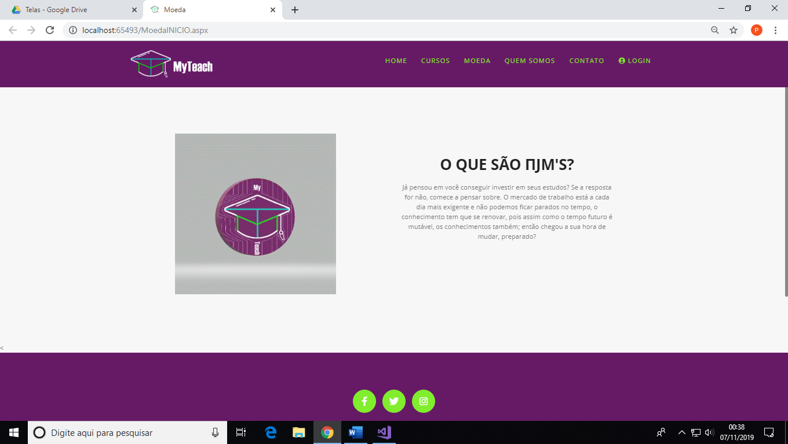
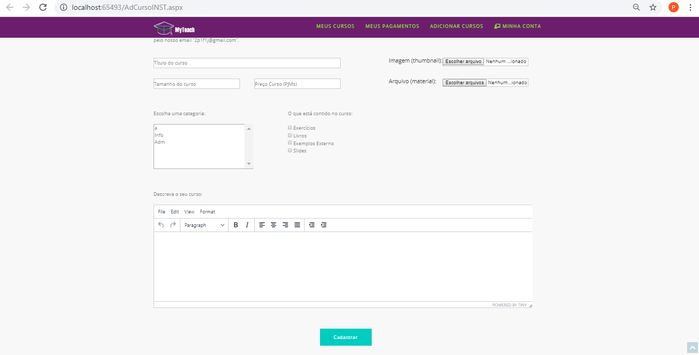
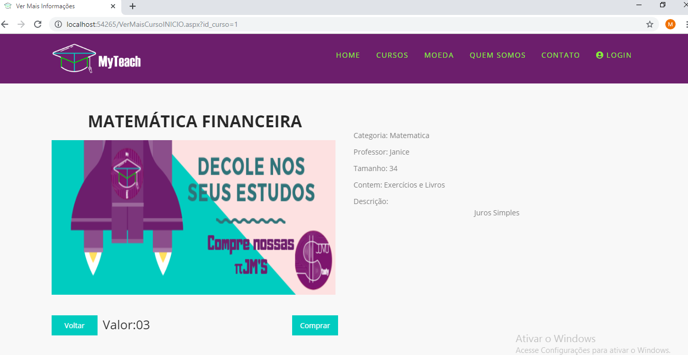
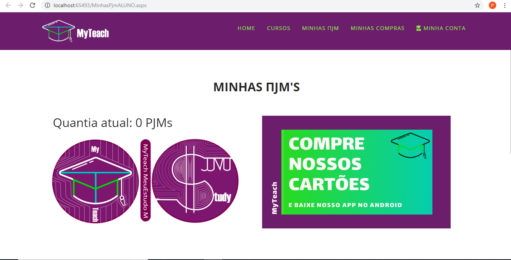
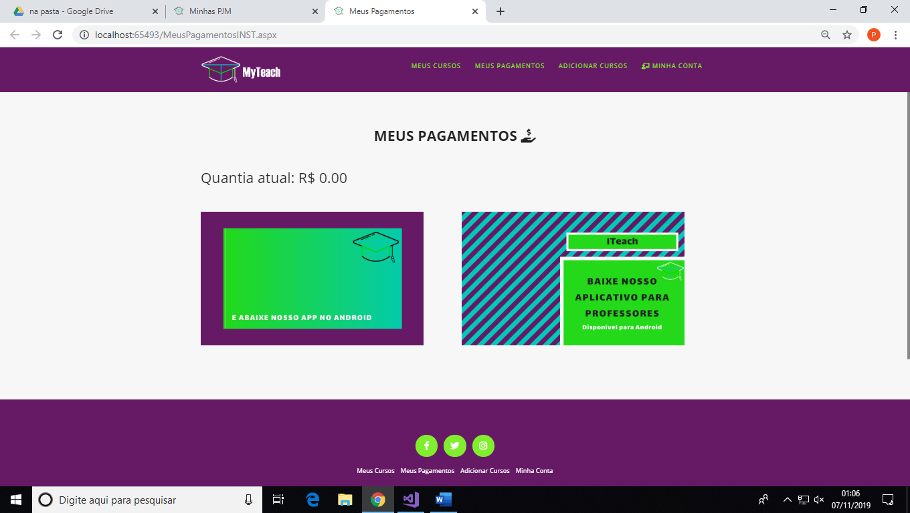

<h1 align="center">
    
</h1>

<h4 align="center"> 
	:heavy_check_mark: 🚀 Plataforma de ensino online MyTeach :heavy_check_mark:
</h4>

    &nbsp;&nbsp;&nbsp;&nbsp;&nbsp;
    &nbsp;&nbsp;&nbsp;&nbsp;&nbsp;
    &nbsp;&nbsp;&nbsp;&nbsp;&nbsp;
    &nbsp;&nbsp;&nbsp;&nbsp;&nbsp;    
    &nbsp;&nbsp;&nbsp;&nbsp;&nbsp;
    &nbsp;&nbsp;&nbsp;&nbsp;&nbsp;

    O MyTeach é uma plataforma que disponibiliza cursos onlines na troca de
moedas digitais – πJM’s – onde o consumidor consegue ter retorno de algumas
moedas - πJModel Return- para poder investir em outros cursos de nosso site. Ele
foi pensado em atender a necessidade de atualização das informações para o
mercado de trabalho ou nos estudos. Seu desenvolvimento contribui no aprendizado
e na vida econômica de nossos usuários pois comprando ele ganha mais que o
curso, ganha também moedas, isso tudo sem sair de casa para estudar.

  <a href="#Tecnologias">Tecnologias</a>&nbsp;&nbsp;&nbsp;|&nbsp;&nbsp;&nbsp;
    <a href="#Metodologias">Metodologias</a>&nbsp;&nbsp;&nbsp;|&nbsp;&nbsp;&nbsp;
  <a href="#information_source-how-to-use">Como Usar</a>&nbsp;&nbsp;&nbsp;|&nbsp;&nbsp;&nbsp;
  <a href="#memo-license">Licença</a>

  

## :Tecnologias

Esse projeto foi desenvolvido com  as seguintes tecnologias:

-  [Asp.NET](https://reactjs.org/)
-  [C#](https://reactjs.org/)
-  [HTML5](https://reactjs.org/)
-  [CSS3](https://reactjs.org/)
-  [BootStrap](https://reactjs.org/)
-  [JQuery](https://reactjs.org/)
-  [MySQL5.5](https://reactjs.org/)
-  [Android Studio](https://reactjs.org/)
-  [Java](https://reactjs.org/)

## :Metodologias
-  [Design Thinking](https://reactjs.org/)
-  [Design Sprint](https://reactjs.org/)
-  [UX Design](https://reactjs.org/)

## :information_source: How To Use

Para clonar e usar essa aplicação você vai precisar de Visual Studio 2017, MySQL 5.5 and Android Studio 3.5

## :memo: License
This project is under the MIT license. See the [LICENSE] for more information.

---

Made with ♥ by Adilson Oliveira :wave: [Get in touch!] linkendin

[VisualStudio2017]: https://visualstudio2017.com
